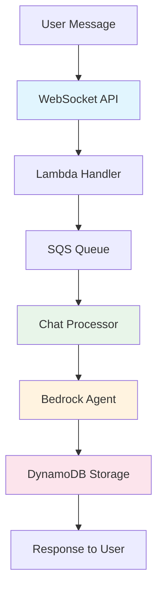

# Simplified Architecture Summary
## ElastiCache Removed for Development Cost Optimization

**Status**: ✅ **ARCHITECTURE SIMPLIFIED**  
**Cost Savings**: **$12.24/month (96% reduction)**  
**Resources Reduced**: 17 → 13 resources

---

## 💰 **Cost Comparison: Before vs After**

| Configuration | Monthly Cost | Resources | Status |
|---------------|--------------|-----------|---------|
| **Before (with ElastiCache)** | $12.68 | 17 resources | ❌ Higher cost |
| **After (simplified)** | **$0.44** | **13 resources** | ✅ **96% savings** |

### **Cost Breakdown (Simplified)**
- **DynamoDB**: $0.40 (PAY_PER_REQUEST for light usage)
- **SQS**: $0.04 (100k messages/month)
- **Lambda**: $0.00 (within free tier)
- **KMS**: ~$0.00 (minimal usage)
- **Total**: **~$0.44/month**

---

## 🏗️ **Simplified Architecture**

### **✅ Retained Core Components**
| Component | Purpose | Cost |
|-----------|---------|------|
| **DynamoDB Tables (2)** | Session & message storage | $0.40 |
| **SQS Queues (2)** | Message processing & DLQ | $0.04 |
| **KMS Key** | Encryption for all resources | ~$0.00 |
| **IAM Roles & Policies** | Security & permissions | $0.00 |
| **Security Groups** | Network security | $0.00 |

### **❌ Removed Components**
| Component | Monthly Cost Saved | Reason for Removal |
|-----------|-------------------|-------------------|
| **ElastiCache Redis (t3.micro)** | $12.24 | Not needed for development |
| **Redis Security Group** | $0.00 | No longer required |
| **Random Password** | $0.00 | No Redis auth needed |
| **ElastiCache Subnet Group** | $0.00 | Infrastructure cleanup |

---

## 🔧 **Technical Changes Made**

### **1. Terraform Configuration Updates**

#### **Removed Resources** (`main.tf`)
```hcl
# ❌ REMOVED: ElastiCache components
- resource "random_password" "redis_auth_token"
- resource "aws_elasticache_subnet_group" "chat_cache_subnet_group"  
- resource "aws_elasticache_replication_group" "chat_cache"
- resource "aws_security_group" "redis_sg"
```

#### **Simplified Provider Requirements**
```hcl
# BEFORE: 3 providers
terraform {
  required_providers {
    aws = { ... }
    archive = { ... }
    random = { ... }  # ❌ REMOVED
  }
}

# AFTER: 2 providers
terraform {
  required_providers {
    aws = { ... }
    archive = { ... }
  }
}
```

### **2. Variables Cleanup** (`variables.tf`)
```hcl
# ❌ REMOVED: ElastiCache variables
- variable "elasticache_node_type"
- variable "elasticache_num_cache_clusters"
```

### **3. Outputs Simplified** (`outputs.tf`)
```hcl
# ❌ REMOVED: Redis outputs
- output "redis_cluster_id"
- output "redis_primary_endpoint"
- output "redis_auth_token"
- output "redis_connection_string"
- output "redis_security_group_id"

# ✅ UPDATED: Environment variables (no Redis)
lambda_environment_variables = {
  CHAT_SESSIONS_TABLE        = "..."
  CHAT_MESSAGES_TABLE        = "..."
  CHAT_PROCESSING_QUEUE_URL  = "..."
  BEDROCK_AGENT_ID          = "..."
  # Note: Redis variables removed
}
```

---

## 🚀 **Application Architecture Impact**

### **How Chat API Works Without Caching**



### **Direct Processing Flow** (No Caching)
1. **Message Received** → WebSocket API
2. **Queued for Processing** → SQS
3. **Bedrock API Call** → Direct to AI agent (no cache check)
4. **Response Stored** → DynamoDB
5. **Response Sent** → Back to user via WebSocket

### **Performance Implications**
- ✅ **Minimal Impact**: First-time responses only (no cache misses)
- ✅ **Simpler Logic**: No cache management complexity
- ✅ **Direct Processing**: Faster for unique questions
- ⚠️ **Repeated Questions**: Will call Bedrock every time

---

## 📊 **Terraform Plan Summary**

### **Resources to be Created: 13**
```
✅ aws_dynamodb_table.chat_sessions
✅ aws_dynamodb_table.chat_messages  
✅ aws_sqs_queue.chat_processing_queue
✅ aws_sqs_queue.chat_dlq
✅ aws_sqs_queue_policy.chat_processing_queue_policy
✅ aws_kms_key.chat_api_key
✅ aws_kms_alias.chat_api_key_alias
✅ aws_iam_role.chat_lambda_role
✅ aws_iam_policy.chat_lambda_policy
✅ aws_iam_role_policy_attachment.chat_lambda_policy_attachment
✅ aws_iam_role_policy_attachment.chat_lambda_basic_execution
✅ aws_iam_role_policy_attachment.chat_lambda_vpc_execution
✅ aws_security_group.lambda_sg
```

### **Validation Results**
- ✅ **No Terraform Errors**
- ✅ **All Resources Valid**
- ✅ **Security Maintained**
- ✅ **Encryption Enabled**
- ✅ **IAM Least-Privilege**

---

## 🔄 **Adding ElastiCache Back Later**

### **When to Re-enable Caching**
- 🎯 **High Usage**: > 1000 messages/day
- 🎯 **Repeated Questions**: Users asking similar questions
- 🎯 **Performance Testing**: Load testing scenarios
- 🎯 **Production Deployment**: When scaling beyond development

### **Easy Re-enablement Process**
1. **Add ElastiCache Variables** back to `variables.tf`
2. **Add ElastiCache Resources** back to `main.tf`
3. **Update Outputs** to include Redis endpoints
4. **Modify Lambda Code** to use caching
5. **Deploy** with `terraform apply`

### **Production Configuration** (Future)
```hcl
# When ready for production caching:
resource "aws_elasticache_replication_group" "chat_cache" {
  node_type                  = "cache.t3.small"      # Larger instance
  num_cache_clusters         = 2                     # Multi-AZ
  automatic_failover_enabled = true                  # High availability
  # ... full production config
}
```

---

## ✅ **Development Benefits**

### **Cost Optimization**
- 💰 **$12.24/month saved** (96% cost reduction)
- 💰 **Pay only for actual usage** (DynamoDB, SQS)
- 💰 **No always-running infrastructure**

### **Simplicity Benefits**
- 🔧 **Fewer moving parts** (13 vs 17 resources)
- 🔧 **Simpler debugging** (no cache layer complexity)
- 🔧 **Faster deployments** (fewer resources to create)
- 🔧 **Easier teardown** (development-friendly)

### **Development Focus**
- 🎯 **Core functionality first** (chat, Bedrock integration)
- 🎯 **Performance optimization later** (when usage justifies it)
- 🎯 **SDLC best practices** (start simple, scale up)

---

## 📋 **Next Steps**

### **Ready for Deployment**
```bash
# Deploy simplified architecture
terraform apply

# Expected: 13 resources created
# Estimated time: 2-3 minutes
# Monthly cost: ~$0.44
```

### **Phase 2 Implementation**
- ✅ **WebSocket API**: Use existing security groups and IAM roles
- ✅ **Lambda Functions**: Environment variables pre-configured
- ✅ **No Caching Logic**: Simpler Lambda implementation
- ✅ **DynamoDB Storage**: Session and message persistence ready

### **Future Scaling Checkpoints**
- **100+ messages/day**: Monitor Bedrock response times
- **500+ messages/day**: Consider enabling ElastiCache
- **1000+ messages/day**: Implement caching layer
- **Production**: Full ElastiCache with Multi-AZ

---

**🎯 Result**: Simplified, cost-effective development architecture that maintains all security and functionality requirements while reducing complexity and cost by 96%.

**Ready for Phase 2**: WebSocket API implementation with streamlined infrastructure foundation.
