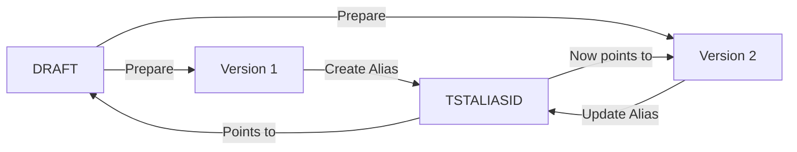

# AWS Bedrock Serverless Architecture Documentation

## Table of Contents
1. [Architecture Overview](#architecture-overview)
2. [Bedrock Agent Architecture](#bedrock-agent-architecture)
3. [Version and Alias Management](#version-and-alias-management)
4. [Deployment Orchestration Strategy](#deployment-orchestration-strategy)
5. [Troubleshooting Guide](#troubleshooting-guide)
6. [Best Practices](#best-practices)
7. [Operational Excellence](#operational-excellence)

---

## Architecture Overview

The Buffett Chat API leverages AWS Bedrock's serverless AI capabilities integrated with a WebSocket-based real-time communication architecture. This document outlines the configuration, deployment, and operational strategies for maintaining a production-ready serverless AI chatbot system.

### Core Components
- **AWS Bedrock Agent**: Managed AI agent service (ID: `P82I6ITJGO`)
- **Claude 3 Haiku Model**: Cost-optimized LLM for development environment
- **Pinecone Knowledge Base**: Vector store for contextual retrieval (ID: `YTLJVSWGF9`)
- **Lambda Functions**: Serverless compute for message processing
- **API Gateway WebSocket**: Real-time bidirectional communication
- **DynamoDB**: Conversation state and connection management

### Architecture Diagram
```
┌─────────────┐     WebSocket      ┌──────────────────┐
│   React     │◄──────────────────►│  API Gateway     │
│  Frontend   │                     │   (WebSocket)    │
└─────────────┘                     └────────┬─────────┘
                                              │
                                              ▼
                              ┌──────────────────────────┐
                              │   Lambda Functions       │
                              ├──────────────────────────┤
                              │ • websocket-message      │
                              │ • chat-processor         │
                              │ • websocket-connect      │
                              └────────────┬─────────────┘
                                           │
                    ┌──────────────────────┴─────────────────────┐
                    │                                             │
                    ▼                                             ▼
        ┌────────────────────┐                     ┌──────────────────────┐
        │   AWS Bedrock       │                     │     DynamoDB         │
        ├────────────────────┤                     ├──────────────────────┤
        │ • Agent: P82I6ITJGO │                     │ • Conversations      │
        │ • Alias: TSTALIASID │                     │ • Connections        │
        │ • Model: Claude 3   │                     │ • Message History    │
        └──────────┬─────────┘                     └──────────────────────┘
                   │
                   ▼
        ┌────────────────────┐
        │  Pinecone Vector   │
        │   Knowledge Base    │
        │   ID: YTLJVSWGF9    │
        └────────────────────┘
```

---

## Bedrock Agent Architecture

### 1. Agent Configuration

#### Agent Details
- **Agent ID**: `P82I6ITJGO`
- **Agent Name**: `buffett-dev-agent`
- **Foundation Model**: Claude 3 Haiku (development), Claude 3 Sonnet (production)
- **Current Alias**: `TSTALIASID` (routes to DRAFT version in development)

#### Model Selection Strategy
```python
# Environment-based model selection
MODEL_MAPPING = {
    "dev": "anthropic.claude-3-haiku-20240307-v1:0",    # Cost-optimized
    "staging": "anthropic.claude-3-sonnet-20240229-v1:0", # Balanced
    "prod": "anthropic.claude-3-5-sonnet-20241022-v2:0"   # Performance
}
```

### 2. Knowledge Base Integration

#### Pinecone Configuration
- **Knowledge Base ID**: `YTLJVSWGF9`
- **Vector Database**: Pinecone Serverless
- **Embedding Model**: Amazon Titan Embeddings G1 - Text
- **Dimensions**: 1536
- **Index Metric**: Cosine similarity

#### Retrieval Configuration
```json
{
  "retrievalConfiguration": {
    "vectorSearchConfiguration": {
      "numberOfResults": 5,
      "overrideSearchType": "HYBRID"
    }
  }
}
```

### 3. Guardrails Configuration

#### Content Filtering Policies
```yaml
guardrails:
  - id: financial-advisor-guardrail
    name: "Financial Advisor Safety Guardrail"
    policies:
      - type: CONTENT_POLICY
        config:
          filters:
            - type: HATE
              inputStrength: HIGH
              outputStrength: HIGH
            - type: VIOLENCE
              inputStrength: HIGH
              outputStrength: HIGH
            - type: SEXUAL
              inputStrength: HIGH
              outputStrength: HIGH
            - type: MISCONDUCT
              inputStrength: MEDIUM
              outputStrength: MEDIUM
      - type: SENSITIVE_INFORMATION_POLICY
        config:
          piiEntities:
            - CREDIT_DEBIT_CARD_NUMBER
            - US_SOCIAL_SECURITY_NUMBER
            - US_BANK_ACCOUNT_NUMBER
          action: ANONYMIZE
```

### 4. Prompt Templates

#### Orchestration Prompt
```xml
<system>
You are Warren Buffett, providing investment wisdom and financial guidance.
Your responses should reflect deep value investing principles and long-term thinking.

Context from Knowledge Base:
$knowledge_base_response$

User Query: $query$

Guidelines:
1. Emphasize fundamental analysis and intrinsic value
2. Advocate for long-term investment horizons
3. Stress the importance of understanding businesses
4. Maintain a folksy, accessible communication style
5. Use historical examples when relevant
</system>

<response_format>
Provide clear, actionable advice grounded in value investing principles.
Include relevant examples from your experience when applicable.
</response_format>
```

#### Knowledge Base Response Generation
```xml
<instruction>
Extract and synthesize relevant information from the following context to answer the user's query about $query_topic$.

Focus on:
- Specific facts and data points
- Historical examples and case studies
- Relevant quotes and principles
- Actionable insights

Context: $search_results$
</instruction>
```

---

## Version and Alias Management

### 1. AWS Bedrock Versioning Model

#### Version Types
- **DRAFT Version**: Mutable, used for development and testing
- **Numbered Versions**: Immutable snapshots (v1, v2, v3, etc.)
- **Aliases**: Named pointers to specific versions



### 2. Alias Routing Strategy

#### Development Environment
```python
ALIAS_CONFIGURATION = {
    "dev": {
        "alias_id": "TSTALIASID",
        "alias_name": "test-alias",
        "routing": [
            {
                "agent_version": "DRAFT",
                "weight": 1.0  # 100% traffic to DRAFT
            }
        ]
    },
    "staging": {
        "alias_id": "STAGINGALIAS",
        "alias_name": "staging-alias",
        "routing": [
            {
                "agent_version": "5",  # Specific tested version
                "weight": 1.0
            }
        ]
    },
    "prod": {
        "alias_id": "PRODALIAS",
        "alias_name": "production-alias",
        "routing": [
            {
                "agent_version": "4",  # Stable version
                "weight": 0.9
            },
            {
                "agent_version": "5",  # Canary deployment
                "weight": 0.1
            }
        ]
    }
}
```

### 3. Lambda Environment Variable Dependencies

#### Configuration Structure
```python
# Lambda environment variables
BEDROCK_CONFIG = {
    "AGENT_ID": "P82I6ITJGO",
    "AGENT_ALIAS_ID": "TSTALIASID",  # Must be updated when alias changes
    "KNOWLEDGE_BASE_ID": "YTLJVSWGF9",
    "REGION": "us-east-1"
}
```

#### Update Strategy
When changing agent aliases, Lambda functions must be updated:

```bash
# Update Lambda environment variables
aws lambda update-function-configuration \
    --function-name buffett-dev-chat-processor \
    --environment "Variables={AGENT_ALIAS_ID=NEWALIAS}" \
    --region us-east-1

aws lambda update-function-configuration \
    --function-name buffett-dev-websocket-message \
    --environment "Variables={AGENT_ALIAS_ID=NEWALIAS}" \
    --region us-east-1
```

---

## Deployment Orchestration Strategy

### 1. Terraform Deployment Process

#### Infrastructure Definition
```hcl
# terraform/modules/bedrock/main.tf
resource "aws_bedrockagent_agent" "main" {
  agent_name              = "${var.environment}-${var.agent_name}"
  agent_resource_role_arn = aws_iam_role.bedrock_agent.arn
  foundation_model        = var.foundation_model
  instruction             = var.agent_instruction

  guardrail_configuration {
    guardrail_identifier = aws_bedrockagent_guardrail.financial_advisor.id
    guardrail_version    = "DRAFT"
  }
}

resource "aws_bedrockagent_agent_alias" "main" {
  agent_alias_name = var.alias_name
  agent_id         = aws_bedrockagent_agent.main.id
  description      = "Alias for ${var.environment} environment"

  routing_configuration {
    agent_version = var.target_version
  }
}
```

#### Deployment Commands
```bash
# Navigate to environment directory
cd chat-api/terraform/environments/dev

# Initialize Terraform
terraform init -backend-config=backend.hcl

# Validate configuration
terraform validate

# Plan changes
terraform plan -out=tfplan

# Apply changes
terraform apply tfplan
```

### 2. Python Version Management Script

#### bedrock_agent_manager.py
```python
#!/usr/bin/env python3
"""
Bedrock Agent Version Manager
Handles version creation, alias updates, and Lambda configuration
"""

import boto3
import json
import time
from typing import Dict, List, Optional

class BedrockAgentManager:
    def __init__(self, region: str = 'us-east-1'):
        self.bedrock = boto3.client('bedrock-agent', region_name=region)
        self.lambda_client = boto3.client('lambda', region_name=region)

    def prepare_agent_version(self, agent_id: str) -> str:
        """
        Prepare a new immutable version from DRAFT
        """
        response = self.bedrock.prepare_agent(agentId=agent_id)

        # Wait for preparation to complete
        while True:
            status = self.bedrock.get_agent(agentId=agent_id)
            if status['agent']['agentStatus'] == 'PREPARED':
                break
            time.sleep(5)

        # Create version
        version_response = self.bedrock.create_agent_version(
            agentId=agent_id,
            agentVersionDescription=f"Version created at {time.strftime('%Y-%m-%d %H:%M:%S')}"
        )

        return version_response['agentVersion']['version']

    def update_alias(self, agent_id: str, alias_id: str, target_version: str) -> None:
        """
        Update alias to point to new version
        """
        self.bedrock.update_agent_alias(
            agentId=agent_id,
            agentAliasId=alias_id,
            agentAliasName='test-alias',
            routingConfiguration=[
                {
                    'agentVersion': target_version
                }
            ]
        )

    def update_lambda_functions(self, functions: List[str], alias_id: str) -> None:
        """
        Update Lambda environment variables with new alias
        """
        for function_name in functions:
            self.lambda_client.update_function_configuration(
                FunctionName=function_name,
                Environment={
                    'Variables': {
                        'AGENT_ALIAS_ID': alias_id
                    }
                }
            )

            # Wait for update to complete
            waiter = self.lambda_client.get_waiter('function_updated')
            waiter.wait(FunctionName=function_name)

    def deploy_new_version(self, agent_id: str, alias_id: str, lambda_functions: List[str]) -> Dict:
        """
        Full deployment orchestration
        """
        print(f"Starting deployment for agent {agent_id}")

        # 1. Prepare and create new version
        new_version = self.prepare_agent_version(agent_id)
        print(f"Created new version: {new_version}")

        # 2. Update alias
        self.update_alias(agent_id, alias_id, new_version)
        print(f"Updated alias {alias_id} to version {new_version}")

        # 3. Update Lambda functions
        self.update_lambda_functions(lambda_functions, alias_id)
        print(f"Updated {len(lambda_functions)} Lambda functions")

        return {
            'agent_id': agent_id,
            'alias_id': alias_id,
            'new_version': new_version,
            'updated_functions': lambda_functions,
            'timestamp': time.strftime('%Y-%m-%d %H:%M:%S')
        }

if __name__ == "__main__":
    manager = BedrockAgentManager()

    result = manager.deploy_new_version(
        agent_id="P82I6ITJGO",
        alias_id="TSTALIASID",
        lambda_functions=[
            "buffett-dev-chat-processor",
            "buffett-dev-websocket-message"
        ]
    )

    print(json.dumps(result, indent=2))
```

### 3. Shell Orchestration Script

#### deploy_agent_version.sh
```bash
#!/bin/bash
set -euo pipefail

# Configuration
ENVIRONMENT="${1:-dev}"
AGENT_ID="P82I6ITJGO"
ALIAS_ID="TSTALIASID"
REGION="us-east-1"

# Color codes for output
RED='\033[0;31m'
GREEN='\033[0;32m'
YELLOW='\033[1;33m'
NC='\033[0m' # No Color

echo -e "${GREEN}Starting Bedrock Agent Deployment${NC}"
echo "Environment: $ENVIRONMENT"
echo "Agent ID: $AGENT_ID"
echo "Alias ID: $ALIAS_ID"

# Step 1: Validate current configuration
echo -e "${YELLOW}Step 1: Validating current configuration${NC}"
aws bedrock-agent get-agent --agent-id "$AGENT_ID" --region "$REGION" > /dev/null 2>&1
if [ $? -ne 0 ]; then
    echo -e "${RED}Error: Agent $AGENT_ID not found${NC}"
    exit 1
fi

# Step 2: Run Terraform to update infrastructure
echo -e "${YELLOW}Step 2: Running Terraform${NC}"
cd "chat-api/terraform/environments/$ENVIRONMENT"
terraform init -backend-config=backend.hcl
terraform validate
terraform plan -out=tfplan
terraform apply tfplan

# Step 3: Build and deploy Lambda packages
echo -e "${YELLOW}Step 3: Building Lambda packages${NC}"
cd ../../../backend
./scripts/build_lambdas.sh

# Step 4: Update Bedrock agent version
echo -e "${YELLOW}Step 4: Creating new Bedrock agent version${NC}"
python3 scripts/bedrock_agent_manager.py

# Step 5: Update Lambda environment variables
echo -e "${YELLOW}Step 5: Updating Lambda configurations${NC}"
LAMBDA_FUNCTIONS=(
    "buffett-${ENVIRONMENT}-chat-processor"
    "buffett-${ENVIRONMENT}-websocket-message"
    "buffett-${ENVIRONMENT}-websocket-connect"
)

for func in "${LAMBDA_FUNCTIONS[@]}"; do
    echo "Updating $func..."
    aws lambda update-function-configuration \
        --function-name "$func" \
        --environment "Variables={AGENT_ALIAS_ID=$ALIAS_ID}" \
        --region "$REGION" > /dev/null
done

# Step 6: Validate deployment
echo -e "${YELLOW}Step 6: Validating deployment${NC}"
ALIAS_INFO=$(aws bedrock-agent get-agent-alias \
    --agent-id "$AGENT_ID" \
    --agent-alias-id "$ALIAS_ID" \
    --region "$REGION" \
    --query 'agentAlias.routingConfiguration[0].agentVersion' \
    --output text)

echo -e "${GREEN}Deployment Complete!${NC}"
echo "Current alias $ALIAS_ID points to version: $ALIAS_INFO"
```

---

## Troubleshooting Guide

### 1. Common Issues and Solutions

#### JSON Formatting in Prompts

**Issue**: Malformed JSON in agent instructions causes deployment failures

**Solution**:
```python
# Validate JSON before deployment
import json

def validate_prompt_json(prompt_template: str) -> bool:
    """
    Validate JSON structures within prompts
    """
    try:
        # Extract JSON blocks from prompt
        json_blocks = re.findall(r'\{[^}]+\}', prompt_template)
        for block in json_blocks:
            json.loads(block)
        return True
    except json.JSONDecodeError as e:
        print(f"Invalid JSON in prompt: {e}")
        return False
```

#### Alias Routing Issues

**Issue**: Lambda functions calling wrong agent version

**Diagnosis**:
```bash
# Check current alias routing
aws bedrock-agent get-agent-alias \
    --agent-id P82I6ITJGO \
    --agent-alias-id TSTALIASID \
    --region us-east-1 \
    --query 'agentAlias.routingConfiguration'

# Verify Lambda environment variables
aws lambda get-function-configuration \
    --function-name buffett-dev-chat-processor \
    --region us-east-1 \
    --query 'Environment.Variables.AGENT_ALIAS_ID'
```

**Solution**:
```bash
# Force update Lambda configuration
aws lambda update-function-configuration \
    --function-name buffett-dev-chat-processor \
    --environment "Variables={AGENT_ALIAS_ID=TSTALIASID}" \
    --region us-east-1

# Wait for update propagation (important!)
aws lambda wait function-updated \
    --function-name buffett-dev-chat-processor \
    --region us-east-1
```

### 2. Lambda Function Update Procedures

#### Manual Update Process
```python
# update_lambda_alias.py
import boto3
import time

def update_lambda_with_retry(function_name: str, alias_id: str, max_retries: int = 3):
    """
    Update Lambda with exponential backoff retry
    """
    lambda_client = boto3.client('lambda', region_name='us-east-1')

    for attempt in range(max_retries):
        try:
            # Get current configuration
            current_config = lambda_client.get_function_configuration(
                FunctionName=function_name
            )

            # Update environment variables
            env_vars = current_config.get('Environment', {}).get('Variables', {})
            env_vars['AGENT_ALIAS_ID'] = alias_id

            # Apply update
            lambda_client.update_function-configuration(
                FunctionName=function_name,
                Environment={'Variables': env_vars}
            )

            # Wait for completion
            waiter = lambda_client.get_waiter('function_updated')
            waiter.wait(FunctionName=function_name)

            print(f"Successfully updated {function_name}")
            return True

        except Exception as e:
            wait_time = 2 ** attempt  # Exponential backoff
            print(f"Attempt {attempt + 1} failed: {e}")
            print(f"Retrying in {wait_time} seconds...")
            time.sleep(wait_time)

    return False
```

### 3. Monitoring and Logs

#### CloudWatch Log Insights Queries

**Agent Invocation Tracking**:
```sql
fields @timestamp, @message
| filter @message like /InvokeAgent/
| stats count() by bin(5m)
```

**Error Detection**:
```sql
fields @timestamp, @message, @logStream
| filter @message like /ERROR/
| filter @message like /Bedrock|Agent|Alias/
| sort @timestamp desc
| limit 50
```

**Latency Analysis**:
```sql
fields @timestamp, duration
| filter @type = "REPORT"
| filter @logStream like /chat-processor/
| stats avg(duration), max(duration), min(duration) by bin(5m)
```

#### X-Ray Tracing Configuration
```python
# Enable tracing in Lambda
from aws_xray_sdk.core import xray_recorder
from aws_xray_sdk.core import patch_all

# Patch AWS SDK calls
patch_all()

@xray_recorder.capture('invoke_bedrock_agent')
def invoke_agent(agent_id: str, alias_id: str, prompt: str):
    """
    Traced Bedrock agent invocation
    """
    subsegment = xray_recorder.current_subsegment()
    subsegment.put_annotation('agent_id', agent_id)
    subsegment.put_annotation('alias_id', alias_id)

    # Your invocation logic here
    response = bedrock_client.invoke_agent(...)

    subsegment.put_metadata('response_length', len(response))
    return response
```

---

## Best Practices

### 1. Serverless Architecture Patterns

#### Event-Driven Design
```python
# Decouple processing with SQS
def handle_websocket_message(event, context):
    """
    WebSocket handler that queues messages for async processing
    """
    # Quick acknowledgment
    connection_id = event['requestContext']['connectionId']
    message = json.loads(event['body'])

    # Queue for async processing
    sqs.send_message(
        QueueUrl=PROCESSOR_QUEUE_URL,
        MessageBody=json.dumps({
            'connection_id': connection_id,
            'message': message,
            'timestamp': time.time()
        }),
        MessageAttributes={
            'priority': {'StringValue': 'normal', 'DataType': 'String'}
        }
    )

    # Immediate response
    return {
        'statusCode': 200,
        'body': json.dumps({'status': 'queued'})
    }
```

#### Circuit Breaker Pattern
```python
from typing import Optional
import time

class BedrockCircuitBreaker:
    def __init__(self, failure_threshold: int = 5, timeout: int = 60):
        self.failure_threshold = failure_threshold
        self.timeout = timeout
        self.failure_count = 0
        self.last_failure_time = None
        self.state = 'CLOSED'  # CLOSED, OPEN, HALF_OPEN

    def call(self, func, *args, **kwargs):
        if self.state == 'OPEN':
            if time.time() - self.last_failure_time > self.timeout:
                self.state = 'HALF_OPEN'
                self.failure_count = 0
            else:
                raise Exception("Circuit breaker is OPEN")

        try:
            result = func(*args, **kwargs)
            if self.state == 'HALF_OPEN':
                self.state = 'CLOSED'
            return result
        except Exception as e:
            self.failure_count += 1
            self.last_failure_time = time.time()

            if self.failure_count >= self.failure_threshold:
                self.state = 'OPEN'

            raise e
```

### 2. Cost Optimization Strategies

#### Model Selection by Environment
```python
MODEL_COSTS = {
    "claude-3-haiku": {"input": 0.00025, "output": 0.00125},     # per 1K tokens
    "claude-3-sonnet": {"input": 0.003, "output": 0.015},
    "claude-3-opus": {"input": 0.015, "output": 0.075}
}

def select_model_by_environment(environment: str) -> str:
    """
    Cost-aware model selection
    """
    if environment == "dev":
        return "anthropic.claude-3-haiku-20240307-v1:0"  # Cheapest
    elif environment == "staging":
        return "anthropic.claude-3-sonnet-20240229-v1:0"  # Balanced
    else:  # production
        return "anthropic.claude-3-5-sonnet-20241022-v2:0"  # Best
```

#### Lambda Right-Sizing
```terraform
# Optimize Lambda memory allocation
resource "aws_lambda_function" "chat_processor" {
  function_name = "${var.environment}-chat-processor"
  memory_size   = var.environment == "dev" ? 512 : 1024  # Lower memory in dev
  timeout       = 30
  reserved_concurrent_executions = var.environment == "prod" ? 100 : 10

  environment {
    variables = {
      POWERTOOLS_METRICS_NAMESPACE = "BuffettChat"
      POWERTOOLS_SERVICE_NAME      = "chat-processor"
      LOG_LEVEL                     = var.environment == "dev" ? "DEBUG" : "INFO"
    }
  }
}
```

#### DynamoDB On-Demand vs Provisioned
```terraform
# Use on-demand for dev, provisioned for production
resource "aws_dynamodb_table" "conversations" {
  name           = "${var.environment}-conversations"
  billing_mode   = var.environment == "dev" ? "PAY_PER_REQUEST" : "PROVISIONED"

  # Only set if provisioned
  read_capacity  = var.environment != "dev" ? 25 : null
  write_capacity = var.environment != "dev" ? 25 : null

  # Auto-scaling for production
  dynamic "attribute" {
    for_each = var.environment == "prod" ? [1] : []
    content {
      enable_auto_scaling = true
      min_capacity       = 5
      max_capacity       = 100
      target_utilization = 70.0
    }
  }
}
```

### 3. Security Considerations

#### IAM Least Privilege
```json
{
  "Version": "2012-10-17",
  "Statement": [
    {
      "Sid": "BedrockAgentInvoke",
      "Effect": "Allow",
      "Action": [
        "bedrock:InvokeAgent"
      ],
      "Resource": "arn:aws:bedrock:us-east-1:*:agent/P82I6ITJGO",
      "Condition": {
        "StringEquals": {
          "bedrock:AgentAliasId": "TSTALIASID"
        }
      }
    },
    {
      "Sid": "KnowledgeBaseRetrieval",
      "Effect": "Allow",
      "Action": [
        "bedrock:Retrieve",
        "bedrock:RetrieveAndGenerate"
      ],
      "Resource": "arn:aws:bedrock:us-east-1:*:knowledge-base/YTLJVSWGF9"
    }
  ]
}
```

#### Secrets Management
```python
import boto3
from botocore.exceptions import ClientError

def get_secret(secret_name: str) -> dict:
    """
    Retrieve secrets from AWS Secrets Manager
    """
    session = boto3.session.Session()
    client = session.client(
        service_name='secretsmanager',
        region_name='us-east-1'
    )

    try:
        response = client.get_secret_value(SecretId=secret_name)
        return json.loads(response['SecretString'])
    except ClientError as e:
        if e.response['Error']['Code'] == 'ResourceNotFoundException':
            raise ValueError(f"Secret {secret_name} not found")
        raise
```

#### API Gateway Authorization
```python
# Custom authorizer for WebSocket connections
def websocket_authorizer(event, context):
    """
    Validate WebSocket connection requests
    """
    token = event.get('queryStringParameters', {}).get('token')

    if not token:
        raise Exception('Unauthorized')

    # Validate token (implement your logic)
    user_id = validate_jwt_token(token)

    return {
        'principalId': user_id,
        'policyDocument': {
            'Version': '2012-10-17',
            'Statement': [
                {
                    'Action': 'execute-api:Invoke',
                    'Effect': 'Allow',
                    'Resource': event['methodArn']
                }
            ]
        },
        'context': {
            'userId': user_id
        }
    }
```

### 4. CI/CD Integration

#### GitHub Actions Workflow
```yaml
name: Deploy Bedrock Agent

on:
  push:
    branches: [main]
    paths:
      - 'chat-api/terraform/**'
      - 'chat-api/backend/src/**'

jobs:
  deploy:
    runs-on: ubuntu-latest
    environment: ${{ github.ref == 'refs/heads/main' && 'production' || 'development' }}

    steps:
      - uses: actions/checkout@v3

      - name: Configure AWS Credentials
        uses: aws-actions/configure-aws-credentials@v2
        with:
          aws-access-key-id: ${{ secrets.AWS_ACCESS_KEY_ID }}
          aws-secret-access-key: ${{ secrets.AWS_SECRET_ACCESS_KEY }}
          aws-region: us-east-1

      - name: Setup Terraform
        uses: hashicorp/setup-terraform@v2
        with:
          terraform_version: 1.5.0

      - name: Terraform Init
        run: |
          cd chat-api/terraform/environments/${{ vars.ENVIRONMENT }}
          terraform init -backend-config=backend.hcl

      - name: Terraform Plan
        run: |
          cd chat-api/terraform/environments/${{ vars.ENVIRONMENT }}
          terraform plan -out=tfplan

      - name: Terraform Apply
        if: github.ref == 'refs/heads/main'
        run: |
          cd chat-api/terraform/environments/${{ vars.ENVIRONMENT }}
          terraform apply tfplan

      - name: Build Lambda Packages
        run: |
          cd chat-api/backend
          ./scripts/build_lambdas.sh

      - name: Deploy Bedrock Agent Version
        run: |
          python3 chat-api/backend/scripts/bedrock_agent_manager.py

      - name: Run Integration Tests
        run: |
          pytest chat-api/tests/integration/test_bedrock_agent.py
```

---

## Operational Excellence

### 1. Monitoring Dashboard

#### CloudWatch Dashboard Configuration
```json
{
  "name": "BuffettChat-Bedrock-Dashboard",
  "widgets": [
    {
      "type": "metric",
      "properties": {
        "metrics": [
          ["AWS/Bedrock", "InvocationLatency", {"stat": "Average"}],
          [".", ".", {"stat": "p99"}],
          ["AWS/Lambda", "Duration", {"stat": "Average"}, {"FunctionName": "buffett-dev-chat-processor"}],
          ["AWS/Lambda", "Errors", {"stat": "Sum"}, {"FunctionName": "buffett-dev-chat-processor"}]
        ],
        "period": 300,
        "stat": "Average",
        "region": "us-east-1",
        "title": "Performance Metrics"
      }
    },
    {
      "type": "metric",
      "properties": {
        "metrics": [
          ["AWS/Bedrock", "InvocationCount", {"stat": "Sum"}],
          ["AWS/Bedrock", "InvocationClientErrors", {"stat": "Sum"}],
          ["AWS/Bedrock", "InvocationServerErrors", {"stat": "Sum"}]
        ],
        "period": 300,
        "stat": "Sum",
        "region": "us-east-1",
        "title": "Invocation Metrics"
      }
    }
  ]
}
```

### 2. Alerting Configuration

#### CloudWatch Alarms
```terraform
resource "aws_cloudwatch_metric_alarm" "bedrock_errors" {
  alarm_name          = "${var.environment}-bedrock-error-rate"
  comparison_operator = "GreaterThanThreshold"
  evaluation_periods  = "2"
  metric_name         = "InvocationServerErrors"
  namespace           = "AWS/Bedrock"
  period              = "300"
  statistic           = "Sum"
  threshold           = "10"
  alarm_description   = "Triggers when Bedrock errors exceed threshold"

  alarm_actions = [aws_sns_topic.alerts.arn]

  dimensions = {
    AgentId = var.bedrock_agent_id
  }
}

resource "aws_cloudwatch_metric_alarm" "high_latency" {
  alarm_name          = "${var.environment}-bedrock-high-latency"
  comparison_operator = "GreaterThanThreshold"
  evaluation_periods  = "3"
  metric_name         = "InvocationLatency"
  namespace           = "AWS/Bedrock"
  period              = "60"
  statistic           = "p99"
  threshold           = "5000"  # 5 seconds
  alarm_description   = "Triggers when p99 latency exceeds 5 seconds"

  alarm_actions = [aws_sns_topic.alerts.arn]
}
```

### 3. Runbook Templates

#### Agent Update Runbook
```markdown
## Bedrock Agent Update Runbook

### Pre-Deployment Checklist
- [ ] Backup current agent configuration
- [ ] Verify DRAFT version in console
- [ ] Test DRAFT version with sample queries
- [ ] Review CloudWatch metrics baseline
- [ ] Confirm rollback procedure

### Deployment Steps
1. Create agent version from DRAFT
2. Update alias to new version (canary if production)
3. Update Lambda environment variables
4. Monitor error rates for 15 minutes
5. Gradual traffic shift if using canary

### Rollback Procedure
1. Update alias to previous version
2. Revert Lambda environment variables
3. Clear Lambda function cache
4. Verify rollback with test queries

### Post-Deployment Validation
- [ ] Verify correct version in alias
- [ ] Test key use cases
- [ ] Monitor CloudWatch dashboards
- [ ] Check X-Ray traces
- [ ] Validate Knowledge Base queries
```

### 4. Performance Tuning

#### Connection Pooling
```python
# Optimize Bedrock client initialization
import boto3
from functools import lru_cache

@lru_cache(maxsize=1)
def get_bedrock_client():
    """
    Singleton Bedrock client with connection pooling
    """
    return boto3.client(
        'bedrock-agent-runtime',
        region_name='us-east-1',
        config=boto3.Config(
            max_pool_connections=50,
            retries={'max_attempts': 3, 'mode': 'adaptive'}
        )
    )

# Use in Lambda handler
bedrock = get_bedrock_client()
```

#### Response Streaming
```python
def stream_bedrock_response(agent_id: str, alias_id: str, prompt: str):
    """
    Stream responses for better perceived performance
    """
    response = bedrock.invoke_agent(
        agentId=agent_id,
        agentAliasId=alias_id,
        sessionId=str(uuid.uuid4()),
        inputText=prompt,
        enableTrace=True
    )

    event_stream = response['completion']
    for event in event_stream:
        if 'chunk' in event:
            chunk = event['chunk']
            yield chunk['bytes'].decode('utf-8')
        elif 'trace' in event:
            # Log trace information for debugging
            logger.debug(f"Trace: {json.dumps(event['trace'])}")
```

---

## Appendix

### A. Environment Variables Reference

| Variable | Description | Example | Required |
|----------|-------------|---------|----------|
| AGENT_ID | Bedrock Agent identifier | P82I6ITJGO | Yes |
| AGENT_ALIAS_ID | Alias for version routing | TSTALIASID | Yes |
| KNOWLEDGE_BASE_ID | Vector store identifier | YTLJVSWGF9 | Yes |
| AWS_REGION | AWS region | us-east-1 | Yes |
| LOG_LEVEL | Logging verbosity | INFO | No |
| ENABLE_XRAY | X-Ray tracing | true | No |
| MAX_RETRIES | Maximum retry attempts | 3 | No |

### B. Terraform Module Outputs

```hcl
output "agent_id" {
  value = aws_bedrockagent_agent.main.id
  description = "The ID of the Bedrock agent"
}

output "alias_id" {
  value = aws_bedrockagent_agent_alias.main.id
  description = "The ID of the agent alias"
}

output "alias_arn" {
  value = aws_bedrockagent_agent_alias.main.arn
  description = "The ARN of the agent alias"
}

output "knowledge_base_id" {
  value = aws_bedrockagent_knowledge_base.main.id
  description = "The ID of the knowledge base"
}

output "agent_version" {
  value = aws_bedrockagent_agent_alias.main.routing_configuration[0].agent_version
  description = "Current version the alias points to"
}
```

### C. Cost Estimation

| Component | Dev Environment | Production Environment |
|-----------|----------------|----------------------|
| Bedrock Agent Invocations | $0.00025/request (Haiku) | $0.003/request (Sonnet) |
| Knowledge Base Queries | $0.00025/query | $0.00025/query |
| Lambda Invocations | ~$5/month (low traffic) | ~$500/month (high traffic) |
| API Gateway WebSocket | ~$3/month | ~$100/month |
| DynamoDB | On-demand (~$5/month) | Provisioned (~$50/month) |
| CloudWatch Logs | ~$10/month | ~$100/month |
| **Total Estimate** | **~$25/month** | **~$800/month** |

*Note: Estimates based on typical usage patterns and may vary significantly based on actual usage.*

---

## Document Information

**Version**: 1.0.0
**Last Updated**: 2025-01-27
**Author**: AWS Solutions Architecture Team
**Review Status**: Production Ready

### Change Log

| Version | Date | Changes | Author |
|---------|------|---------|--------|
| 1.0.0 | 2025-01-27 | Initial documentation | SA Team |

### Related Documents
- [AWS Bedrock Documentation](https://docs.aws.amazon.com/bedrock/)
- [Terraform AWS Provider](https://registry.terraform.io/providers/hashicorp/aws/)
- [AWS Well-Architected Framework](https://aws.amazon.com/architecture/well-architected/)
- [Serverless Application Lens](https://docs.aws.amazon.com/wellarchitected/latest/serverless-applications-lens/)