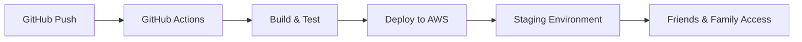

# CI/CD Implementation Guide for Friends & Family Testing

## Overview

This guide provides step-by-step instructions to set up a complete CI/CD pipeline using GitHub Actions for deploying the Buffett Chat API to a staging environment. The setup enables friends and family to test the application without requiring a custom domain, using AWS-provided URLs initially.

## Architecture Overview



## Prerequisites

Before starting, ensure you have:
- GitHub repository with your code
- AWS Account with appropriate permissions
- Terraform installed locally (for initial setup)
- Node.js 18+ and Python 3.11+ installed

## Phase 1: AWS Infrastructure Setup

### Step 1.1: Create S3 Backend for Terraform State

First, create an S3 bucket for Terraform state management:

```bash
# Create S3 bucket for Terraform state
aws s3api create-bucket \
  --bucket buffett-chat-terraform-state-staging \
  --region us-east-1

# Enable versioning
aws s3api put-bucket-versioning \
  --bucket buffett-chat-terraform-state-staging \
  --versioning-configuration Status=Enabled

# Create DynamoDB table for state locking
aws dynamodb create-table \
  --table-name terraform-state-locks \
  --attribute-definitions AttributeName=LockID,AttributeType=S \
  --key-schema AttributeName=LockID,KeyType=HASH \
  --provisioned-throughput ReadCapacityUnits=5,WriteCapacityUnits=5
```

### Step 1.2: Create Staging Environment Configuration

Create a new Terraform environment for staging:

```bash
# Create staging directory
mkdir -p chat-api/terraform/environments/staging
```

Create `chat-api/terraform/environments/staging/main.tf`:

```hcl
terraform {
  required_version = ">= 1.0"

  required_providers {
    aws = {
      source  = "hashicorp/aws"
      version = "~> 5.0"
    }
  }

  backend "s3" {
    bucket         = "buffett-chat-terraform-state-staging"
    key            = "staging/terraform.tfstate"
    region         = "us-east-1"
    dynamodb_table = "terraform-state-locks"
    encrypt        = true
  }
}

provider "aws" {
  region = var.aws_region
}

locals {
  environment  = "staging"
  project_name = var.project_name

  common_tags = {
    Environment = local.environment
    Project     = local.project_name
    ManagedBy   = "Terraform"
    Purpose     = "FriendsAndFamilyTesting"
  }
}

# Include all your existing modules with staging-specific configurations
```

## Phase 2: GitHub Actions Setup

### Step 2.1: Create GitHub Secrets

Navigate to your GitHub repository → Settings → Secrets and variables → Actions

Add the following secrets:

```yaml
AWS_ACCESS_KEY_ID: <your-aws-access-key>
AWS_SECRET_ACCESS_KEY: <your-aws-secret-key>
AWS_REGION: us-east-1
GOOGLE_CLIENT_ID: <your-google-oauth-client-id>
GOOGLE_CLIENT_SECRET: <your-google-oauth-secret>
JWT_SECRET: <generate-a-secure-random-string>
BEDROCK_MODEL_ID: anthropic.claude-3-haiku-20240307-v1:0
```

### Step 2.2: Create GitHub Actions Workflow

Create `.github/workflows/deploy-staging.yml`:

```yaml
name: Deploy to Staging

on:
  push:
    branches:
      - staging
      - main  # Deploy main to staging for now
  workflow_dispatch:  # Allow manual trigger

env:
  AWS_REGION: us-east-1
  ENVIRONMENT: staging
  NODE_VERSION: '18'
  PYTHON_VERSION: '3.11'

jobs:
  build-frontend:
    name: Build Frontend
    runs-on: ubuntu-latest

    steps:
      - name: Checkout code
        uses: actions/checkout@v4

      - name: Setup Node.js
        uses: actions/setup-node@v4
        with:
          node-version: ${{ env.NODE_VERSION }}
          cache: 'npm'
          cache-dependency-path: frontend/package-lock.json

      - name: Install dependencies
        working-directory: frontend
        run: npm ci

      - name: Build frontend
        working-directory: frontend
        env:
          VITE_REST_API_URL: ${{ steps.api-outputs.outputs.api_url }}
          VITE_WEBSOCKET_URL: ${{ steps.api-outputs.outputs.websocket_url }}
        run: npm run build

      - name: Upload frontend artifacts
        uses: actions/upload-artifact@v3
        with:
          name: frontend-dist
          path: frontend/dist

  build-backend:
    name: Build Backend Lambda Functions
    runs-on: ubuntu-latest

    steps:
      - name: Checkout code
        uses: actions/checkout@v4

      - name: Setup Python
        uses: actions/setup-python@v4
        with:
          python-version: ${{ env.PYTHON_VERSION }}

      - name: Build Lambda packages
        working-directory: chat-api/backend
        run: |
          chmod +x scripts/build_lambdas.sh
          chmod +x scripts/build_layer.sh
          ./scripts/build_lambdas.sh

      - name: Upload Lambda packages
        uses: actions/upload-artifact@v3
        with:
          name: lambda-packages
          path: chat-api/backend/build/*.zip

  deploy-infrastructure:
    name: Deploy Infrastructure with Terraform
    runs-on: ubuntu-latest
    needs: [build-backend]

    outputs:
      api_url: ${{ steps.terraform-output.outputs.api_url }}
      websocket_url: ${{ steps.terraform-output.outputs.websocket_url }}
      cloudfront_url: ${{ steps.terraform-output.outputs.cloudfront_url }}

    steps:
      - name: Checkout code
        uses: actions/checkout@v4

      - name: Download Lambda packages
        uses: actions/download-artifact@v3
        with:
          name: lambda-packages
          path: chat-api/backend/build

      - name: Configure AWS credentials
        uses: aws-actions/configure-aws-credentials@v4
        with:
          aws-access-key-id: ${{ secrets.AWS_ACCESS_KEY_ID }}
          aws-secret-access-key: ${{ secrets.AWS_SECRET_ACCESS_KEY }}
          aws-region: ${{ env.AWS_REGION }}

      - name: Setup Terraform
        uses: hashicorp/setup-terraform@v3
        with:
          terraform_version: 1.5.0

      - name: Create Secrets in AWS Secrets Manager
        run: |
          # Create Google OAuth secret
          aws secretsmanager create-secret \
            --name buffett-staging-google-oauth \
            --secret-string '{
              "client_id": "${{ secrets.GOOGLE_CLIENT_ID }}",
              "client_secret": "${{ secrets.GOOGLE_CLIENT_SECRET }}"
            }' \
            --region ${{ env.AWS_REGION }} || true

          # Create JWT secret
          aws secretsmanager create-secret \
            --name buffett-staging-jwt-secret \
            --secret-string "${{ secrets.JWT_SECRET }}" \
            --region ${{ env.AWS_REGION }} || true

      - name: Terraform Init
        working-directory: chat-api/terraform/environments/staging
        run: terraform init

      - name: Terraform Plan
        working-directory: chat-api/terraform/environments/staging
        run: terraform plan -out=tfplan

      - name: Terraform Apply
        working-directory: chat-api/terraform/environments/staging
        run: terraform apply -auto-approve tfplan

      - name: Get Terraform Outputs
        id: terraform-output
        working-directory: chat-api/terraform/environments/staging
        run: |
          echo "api_url=$(terraform output -raw http_api_endpoint)" >> $GITHUB_OUTPUT
          echo "websocket_url=$(terraform output -raw websocket_api_endpoint)" >> $GITHUB_OUTPUT
          echo "cloudfront_url=$(terraform output -raw cloudfront_distribution_url)" >> $GITHUB_OUTPUT

  deploy-frontend:
    name: Deploy Frontend to S3
    runs-on: ubuntu-latest
    needs: [build-frontend, deploy-infrastructure]

    steps:
      - name: Checkout code
        uses: actions/checkout@v4

      - name: Download frontend artifacts
        uses: actions/download-artifact@v3
        with:
          name: frontend-dist
          path: frontend/dist

      - name: Configure AWS credentials
        uses: aws-actions/configure-aws-credentials@v4
        with:
          aws-access-key-id: ${{ secrets.AWS_ACCESS_KEY_ID }}
          aws-secret-access-key: ${{ secrets.AWS_SECRET_ACCESS_KEY }}
          aws-region: ${{ env.AWS_REGION }}

      - name: Deploy to S3
        run: |
          aws s3 sync frontend/dist/ s3://buffett-staging-frontend \
            --delete \
            --cache-control "public, max-age=31536000" \
            --exclude "index.html" \
            --exclude "*.json"

          # Upload index.html and config with no-cache
          aws s3 cp frontend/dist/index.html s3://buffett-staging-frontend/index.html \
            --cache-control "no-cache, no-store, must-revalidate"

      - name: Invalidate CloudFront
        run: |
          DISTRIBUTION_ID=$(aws cloudfront list-distributions \
            --query "DistributionList.Items[?Comment=='buffett-staging-frontend'].Id" \
            --output text)

          aws cloudfront create-invalidation \
            --distribution-id $DISTRIBUTION_ID \
            --paths "/*"

  notify-deployment:
    name: Notify Deployment Status
    runs-on: ubuntu-latest
    needs: [deploy-frontend]
    if: always()

    steps:
      - name: Send deployment notification
        run: |
          echo "Deployment completed!"
          echo "API URL: ${{ needs.deploy-infrastructure.outputs.api_url }}"
          echo "WebSocket URL: ${{ needs.deploy-infrastructure.outputs.websocket_url }}"
          echo "Frontend URL: ${{ needs.deploy-infrastructure.outputs.cloudfront_url }}"
```

## Phase 3: Frontend Configuration

### Step 3.1: Update Frontend Environment Variables

Create `frontend/.env.staging`:

```env
VITE_REST_API_URL=https://YOUR_API_ID.execute-api.us-east-1.amazonaws.com/staging
VITE_WEBSOCKET_URL=wss://YOUR_WS_API_ID.execute-api.us-east-1.amazonaws.com/staging
VITE_ENVIRONMENT=staging
```

### Step 3.2: Update Frontend Build Configuration

Update `frontend/vite.config.js`:

```javascript
import { defineConfig } from 'vite'
import react from '@vitejs/plugin-react'

export default defineConfig({
  plugins: [react()],
  build: {
    outDir: 'dist',
    sourcemap: process.env.NODE_ENV !== 'production',
  },
  define: {
    'process.env.VITE_REST_API_URL': JSON.stringify(process.env.VITE_REST_API_URL),
    'process.env.VITE_WEBSOCKET_URL': JSON.stringify(process.env.VITE_WEBSOCKET_URL),
  }
})
```

## Phase 4: Access Management

### Step 4.1: Create Basic Authentication (Without Custom Domain)

Since you don't have a domain yet, you'll use AWS-provided URLs with basic access control:

1. **CloudFront URL for Frontend**:
   - Format: `https://d1234567890abc.cloudfront.net`
   - Share this URL with friends and family

2. **API Gateway URLs**:
   - REST API: `https://api-id.execute-api.region.amazonaws.com/staging`
   - WebSocket: `wss://ws-api-id.execute-api.region.amazonaws.com/staging`

### Step 4.2: Implement Simple Access Control

Create a simple access list in DynamoDB:

```python
# scripts/manage_access.py
import boto3
import sys

dynamodb = boto3.resource('dynamodb')
table = dynamodb.Table('buffett-staging-access-list')

def add_user(email):
    table.put_item(Item={
        'email': email,
        'access_level': 'beta_tester',
        'created_at': datetime.utcnow().isoformat()
    })
    print(f"Added {email} to access list")

def list_users():
    response = table.scan()
    for item in response['Items']:
        print(f"- {item['email']} ({item['access_level']})")

if __name__ == "__main__":
    if sys.argv[1] == "add":
        add_user(sys.argv[2])
    elif sys.argv[1] == "list":
        list_users()
```

### Step 4.3: Share Access Instructions

Create an email template for friends and family:

```markdown
# Welcome to Buffett Chat API Beta Testing!

Thank you for helping test our application. Here's how to access it:

## Access URL
Visit: https://d1234567890abc.cloudfront.net

## Login Instructions
1. Click "Sign in with Google"
2. Use your Google account to authenticate
3. Your email has been pre-approved for access

## What to Test
- Send messages to the AI assistant
- Try different types of questions
- Test conversation history
- Report any bugs or issues

## Feedback
Please send feedback to: your-email@example.com
Or create an issue: https://github.com/your-username/buffett_chat_api/issues

## Known Limitations
- No custom domain yet (using AWS URLs)
- Limited to 100 requests per day during testing
- Some features may be unstable

Thank you for your help!
```

## Phase 5: Monitoring and Logging

### Step 5.1: Set Up CloudWatch Dashboard

Create a Terraform configuration for monitoring:

```hcl
resource "aws_cloudwatch_dashboard" "staging_dashboard" {
  dashboard_name = "buffett-staging-dashboard"

  dashboard_body = jsonencode({
    widgets = [
      {
        type = "metric"
        properties = {
          metrics = [
            ["AWS/Lambda", "Invocations", { stat = "Sum" }],
            [".", "Errors", { stat = "Sum", color = "#d62728" }],
            [".", "Duration", { stat = "Average" }],
            ["AWS/ApiGateway", "Count", { stat = "Sum" }],
            [".", "4XXError", { stat = "Sum", color = "#ff7f0e" }],
            [".", "5XXError", { stat = "Sum", color = "#d62728" }]
          ]
          view    = "timeSeries"
          period  = 300
          stat    = "Average"
          region  = "us-east-1"
          title   = "API Performance"
        }
      }
    ]
  })
}
```

### Step 5.2: Set Up Error Notifications

```yaml
# Add to GitHub Actions workflow
- name: Set up SNS notifications
  run: |
    aws sns create-topic --name buffett-staging-alerts
    aws sns subscribe \
      --topic-arn arn:aws:sns:us-east-1:${{ secrets.AWS_ACCOUNT_ID }}:buffett-staging-alerts \
      --protocol email \
      --notification-endpoint your-email@example.com
```

## Phase 6: Deployment Process

### Manual Deployment Steps

1. **Push to GitHub**:
   ```bash
   git add .
   git commit -m "Deploy to staging"
   git push origin main
   ```

2. **Monitor GitHub Actions**:
   - Go to Actions tab in GitHub
   - Watch the deployment pipeline
   - Check for any errors

3. **Verify Deployment**:
   ```bash
   # Check API health
   curl https://api-id.execute-api.us-east-1.amazonaws.com/staging/health

   # Check frontend
   open https://d1234567890abc.cloudfront.net
   ```

### Rollback Process

If issues occur:

```bash
# Rollback using Terraform
cd chat-api/terraform/environments/staging
terraform plan -destroy
terraform destroy -auto-approve

# Or revert to previous version
git revert HEAD
git push origin main
```

## Phase 7: Cost Management

### Estimated Monthly Costs (Staging Environment)

| Service | Usage | Cost |
|---------|-------|------|
| API Gateway | 100K requests | $0.10 |
| Lambda | 100K invocations | $0.20 |
| DynamoDB | On-demand, light usage | $2.00 |
| S3 + CloudFront | Frontend hosting | $5.00 |
| CloudWatch | Logs and metrics | $5.00 |
| **Total** | | **~$12.30/month** |

### Cost Optimization Tips

1. **Use AWS Free Tier** where possible
2. **Set up billing alerts** at $20 threshold
3. **Implement request throttling** in API Gateway
4. **Use Lambda provisioned concurrency** sparingly
5. **Clean up unused resources** regularly

## Phase 8: Security Best Practices

### API Security

1. **Rate Limiting**:
   ```hcl
   default_route_settings {
     throttling_rate_limit  = 100
     throttling_burst_limit = 200
   }
   ```

2. **CORS Configuration**:
   ```hcl
   cors_configuration {
     allow_origins = ["https://*.cloudfront.net"]
     allow_methods = ["GET", "POST", "OPTIONS"]
     allow_headers = ["content-type", "authorization"]
   }
   ```

3. **Secrets Rotation**:
   - Rotate JWT secret monthly
   - Update Google OAuth credentials quarterly
   - Use AWS Secrets Manager automatic rotation

### Access Security

1. **IP Allowlisting** (optional):
   ```python
   # In Lambda authorizer
   allowed_ips = ['1.2.3.4', '5.6.7.8']
   source_ip = event['requestContext']['identity']['sourceIp']
   if source_ip not in allowed_ips:
       raise Exception('Unauthorized IP')
   ```

2. **Email Verification**:
   - Pre-approve tester emails
   - Validate against allowlist in auth handler

## Troubleshooting Guide

### Common Issues and Solutions

| Issue | Solution |
|-------|----------|
| Lambda timeout | Increase timeout in Terraform to 30s |
| CORS errors | Check API Gateway CORS configuration |
| WebSocket disconnects | Verify authorizer is working correctly |
| Frontend 404 | Check S3 bucket policy and CloudFront settings |
| Auth failures | Verify Google OAuth credentials in Secrets Manager |
| High costs | Review CloudWatch metrics, implement caching |

### Debug Commands

```bash
# Check Lambda logs
aws logs tail /aws/lambda/buffett-staging-conversations-handler --follow

# Test API endpoint
curl -X GET https://api-id.execute-api.us-east-1.amazonaws.com/staging/health

# Check DynamoDB items
aws dynamodb scan --table-name buffett-staging-conversations

# View deployment status
aws cloudformation describe-stacks --stack-name buffett-staging
```

## Next Steps

Once the staging environment is stable:

1. **Purchase a domain** (e.g., buffettchat.com)
2. **Set up Route 53** for DNS management
3. **Configure custom domain** in API Gateway and CloudFront
4. **Implement SSL certificates** via ACM
5. **Create production environment** with stricter controls
6. **Set up A/B testing** for feature rollouts
7. **Implement analytics** (Google Analytics, Mixpanel)
8. **Add payment processing** if needed (Stripe integration)

## Conclusion

This CI/CD pipeline provides:
- ✅ Automated deployments on push to main
- ✅ Staging environment for testing
- ✅ No domain required initially
- ✅ Secure secrets management
- ✅ Cost-effective for testing phase
- ✅ Easy rollback capabilities
- ✅ Monitoring and alerting
- ✅ Simple access management

Your friends and family can now test the application using the CloudFront URL, with automatic deployments happening whenever you push changes to GitHub!