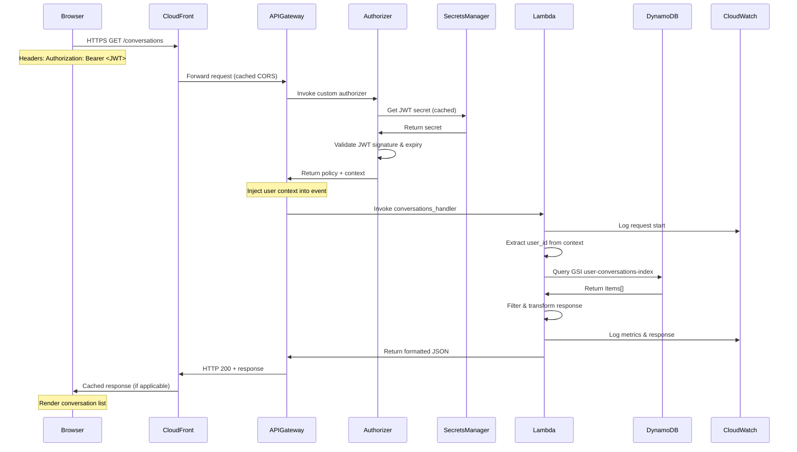
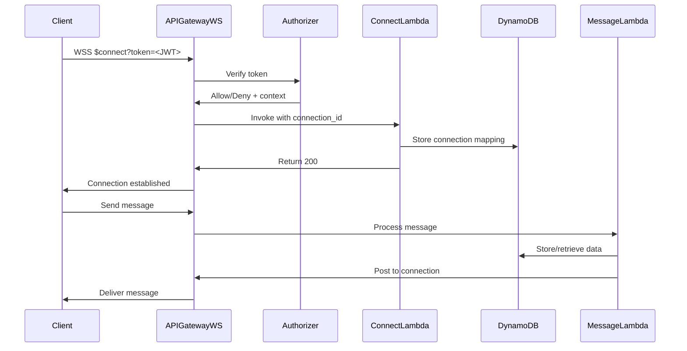

# Conversation Retrieval Architecture

## Executive Summary

This document provides a comprehensive AWS Cloud Architecture overview of the conversation retrieval system for authorized users in the Buffett Chat API. The architecture leverages AWS managed services including API Gateway, Lambda, DynamoDB, and Secrets Manager, deployed via Terraform Infrastructure as Code (IaC). The system implements a serverless, event-driven architecture optimized for scalability, security, and cost-effectiveness in production environments.

## Architecture Overview

The system implements a three-tier serverless architecture:
- **Presentation Tier**: React frontend with API client
- **Logic Tier**: AWS API Gateway + Lambda functions
- **Data Tier**: DynamoDB with optimized indexes

### Key Design Principles
- **Serverless First**: Eliminates infrastructure management overhead
- **Infrastructure as Code**: Complete Terraform automation
- **Security by Design**: Defense-in-depth with JWT authentication
- **Cost Optimization**: Pay-per-use pricing model
- **High Availability**: Multi-AZ deployments
- **Observability**: Comprehensive logging and monitoring

## Infrastructure as Code (Terraform)

### Module Architecture

The infrastructure is organized into reusable Terraform modules:

```hcl
modules/
├── core/           # KMS, IAM roles, SQS queues
├── api-gateway/    # HTTP/WebSocket APIs, authorizers
├── lambda/         # Function deployments, layers
├── dynamodb/       # Tables, indexes, backups
└── auth/           # Authentication infrastructure
```

### Environment Management
- **Workspaces**: Separate dev/staging/prod environments
- **State Management**: Remote S3 backend with DynamoDB locking
- **Variable Management**: Environment-specific tfvars files

## End-to-End Request Flow

### Complete Journey: Frontend to DynamoDB

1. **User Interaction** (Frontend)
   - User navigates to conversation inbox
   - React component triggers API call
   - JWT token attached to request header

2. **API Gateway Processing**
   ```
   HTTPS Request → CloudFront → API Gateway HTTP API
   ```
   - TLS termination at edge
   - Request routing based on path
   - CORS validation

3. **Authorization Layer**
   - Custom authorizer Lambda invoked
   - JWT verification against Secrets Manager
   - User context injection into request

4. **Lambda Execution**
   - Cold start optimization via provisioned concurrency
   - Request context parsing
   - Business logic execution

5. **DynamoDB Query**
   - Global Secondary Index utilization
   - Partition key optimization
   - Response pagination

6. **Response Journey**
   ```
   DynamoDB → Lambda → API Gateway → CloudFront → Frontend
   ```

## Detailed Architecture Components

### 1. Authentication & Authorization Layer

#### Lambda Authorizer Configuration (Terraform)
```hcl
resource "aws_apigatewayv2_authorizer" "http_jwt_authorizer" {
  api_id                            = aws_apigatewayv2_api.http_api.id
  authorizer_type                   = "REQUEST"
  authorizer_uri                    = var.authorizer_function_arn
  authorizer_payload_format_version = "2.0"
  identity_sources                  = ["$request.header.Authorization"]
  enable_simple_responses           = true
}
```

#### JWT Token Verification Process
- **Token Extraction**: From Authorization header or query params
- **Secret Retrieval**: AWS Secrets Manager with caching
- **Validation Steps**:
  1. Signature verification (HS256)
  2. Expiration check
  3. Claims extraction
  4. User context creation

### 2. API Gateway Configuration

#### HTTP API Infrastructure (Terraform)
```hcl
resource "aws_apigatewayv2_api" "http_api" {
  name          = "${var.project_name}-${var.environment}-http-api"
  protocol_type = "HTTP"

  cors_configuration {
    allow_credentials = true
    allow_headers     = ["content-type", "authorization", "x-session-id"]
    allow_methods     = ["GET", "POST", "PUT", "DELETE", "OPTIONS"]
    allow_origins     = var.environment == "prod" ?
                       ["https://production-domain.com"] :
                       ["http://localhost:5173"]
    max_age          = 86400
  }
}
```

#### Stage Configuration
```hcl
resource "aws_apigatewayv2_stage" "http_api_stage" {
  api_id      = aws_apigatewayv2_api.http_api.id
  name        = var.environment
  auto_deploy = true

  default_route_settings {
    detailed_metrics_enabled = true
    throttling_rate_limit   = var.environment == "prod" ? 1000 : 100
    throttling_burst_limit  = var.environment == "prod" ? 2000 : 500
  }

  access_log_settings {
    destination_arn = aws_cloudwatch_log_group.api_gateway_logs.arn
    format         = jsonencode({
      requestId    = "$context.requestId"
      ip          = "$context.identity.sourceIp"
      httpMethod  = "$context.httpMethod"
      status      = "$context.status"
      error       = "$context.error.message"
    })
  }
}
```

#### Route Definitions with Authorization
```hcl
resource "aws_apigatewayv2_route" "list_conversations" {
  api_id    = aws_apigatewayv2_api.http_api.id
  route_key = "GET /conversations"
  target    = "integrations/${aws_apigatewayv2_integration.conversations_handler.id}"

  authorization_type = "CUSTOM"
  authorizer_id     = aws_apigatewayv2_authorizer.http_jwt_authorizer.id
}
```

### 3. Lambda Functions Architecture

#### Lambda Infrastructure (Terraform)
```hcl
resource "aws_lambda_function" "conversations_handler" {
  filename         = "${var.lambda_package_path}/conversations_handler.zip"
  function_name    = "${var.project_name}-${var.environment}-conversations-handler"
  role            = aws_iam_role.lambda_role.arn
  handler         = "conversations_handler.lambda_handler"
  runtime         = "python3.11"
  timeout         = 30
  memory_size     = 256

  layers = [aws_lambda_layer_version.dependencies.arn]

  environment {
    variables = {
      ENVIRONMENT         = var.environment
      CONVERSATIONS_TABLE = aws_dynamodb_table.conversations.name
      MESSAGES_TABLE      = aws_dynamodb_table.chat_messages.name
      LOG_LEVEL          = var.environment == "prod" ? "INFO" : "DEBUG"
    }
  }

  dead_letter_config {
    target_arn = aws_sqs_queue.dlq.arn
  }
}
```

#### IAM Role and Permissions
```hcl
resource "aws_iam_role" "lambda_role" {
  name = "${var.project_name}-${var.environment}-lambda-role"

  assume_role_policy = jsonencode({
    Version = "2012-10-17"
    Statement = [{
      Action = "sts:AssumeRole"
      Effect = "Allow"
      Principal = { Service = "lambda.amazonaws.com" }
    }]
  })
}

resource "aws_iam_policy" "lambda_policy" {
  policy = jsonencode({
    Version = "2012-10-17"
    Statement = [
      {
        Effect = "Allow"
        Action = [
          "dynamodb:Query",
          "dynamodb:GetItem",
          "dynamodb:PutItem",
          "dynamodb:UpdateItem"
        ]
        Resource = [
          "arn:aws:dynamodb:*:*:table/${var.project_name}-${var.environment}-*",
          "arn:aws:dynamodb:*:*:table/${var.project_name}-${var.environment}-*/index/*"
        ]
      },
      {
        Effect = "Allow"
        Action = ["kms:Decrypt", "kms:Encrypt"]
        Resource = aws_kms_key.chat_api_key.arn
      }
    ]
  })
}
```

#### Lambda Layer for Dependencies
```hcl
resource "aws_lambda_layer_version" "dependencies" {
  filename         = "${var.lambda_package_path}/dependencies-layer.zip"
  layer_name       = "${var.project_name}-${var.environment}-dependencies"
  compatible_runtimes = ["python3.11"]

  description = "Shared dependencies: boto3, jwt, etc."
}
```

#### Handler Implementation Details

##### User Identification Flow
```python
def get_user_id(event: Dict[str, Any]) -> Optional[str]:
    # Primary: Authorizer context
    if 'requestContext' in event and 'authorizer' in event['requestContext']:
        authorizer = event['requestContext']['authorizer']
        if 'lambda' in authorizer:
            return authorizer['lambda'].get('user_id')

    # Fallback: JWT decoding
    auth_header = event.get('headers', {}).get('authorization', '')
    if auth_header.startswith('Bearer '):
        token = auth_header[7:]
        # Decode and extract user_id from claims

    return None
```

##### DynamoDB Query Optimization
```python
def list_conversations(event: Dict[str, Any]) -> Dict[str, Any]:
    user_id = get_user_id(event)

    response = conversations_table.query(
        IndexName='user-conversations-index',
        KeyConditionExpression='user_id = :user_id',
        ExpressionAttributeValues={':user_id': user_id},
        ScanIndexForward=False,  # Most recent first
        Limit=50  # Pagination support
    )

    return create_response(200, {
        'conversations': response['Items'],
        'lastEvaluatedKey': response.get('LastEvaluatedKey')
    })
```

### 4. DynamoDB Data Layer

#### Table Architecture (Terraform)

##### Conversations Table Configuration
```hcl
resource "aws_dynamodb_table" "conversations" {
  name           = "${var.project_name}-${var.environment}-conversations"
  billing_mode   = "PAY_PER_REQUEST"  # On-demand pricing
  hash_key       = "conversation_id"

  attribute {
    name = "conversation_id"
    type = "S"
  }

  attribute {
    name = "user_id"
    type = "S"
  }

  attribute {
    name = "updated_at"
    type = "N"
  }

  global_secondary_index {
    name            = "user-conversations-index"
    hash_key        = "user_id"
    range_key       = "updated_at"
    projection_type = "ALL"
  }

  server_side_encryption {
    enabled     = true
    kms_key_arn = aws_kms_key.chat_api_key.arn
  }

  point_in_time_recovery {
    enabled = var.environment == "prod" ? true : false
  }

  deletion_protection_enabled = var.environment == "prod" ? true : false

  tags = {
    Name        = "${var.project_name}-${var.environment}-conversations"
    Environment = var.environment
  }
}
```

##### Messages Table Configuration
```hcl
resource "aws_dynamodb_table" "chat_messages" {
  name           = "${var.project_name}-${var.environment}-chat-messages"
  billing_mode   = var.billing_mode
  hash_key       = "conversation_id"
  range_key      = "message_id"

  attribute {
    name = "conversation_id"
    type = "S"
  }

  attribute {
    name = "message_id"
    type = "S"
  }

  attribute {
    name = "timestamp"
    type = "N"
  }

  local_secondary_index {
    name            = "timestamp-index"
    range_key       = "timestamp"
    projection_type = "ALL"
  }

  ttl {
    attribute_name = "expires_at"
    enabled        = true
  }

  stream_specification {
    stream_enabled   = true
    stream_view_type = "NEW_AND_OLD_IMAGES"
  }
}
```

#### Access Patterns Optimization

##### Primary Access Patterns
1. **List User Conversations**: GSI query by user_id
2. **Get Conversation Messages**: Query by conversation_id
3. **Real-time Updates**: DynamoDB Streams for change capture

##### Performance Considerations
- **Partition Key Design**: Ensures even distribution
- **Hot Partition Prevention**: UUID-based conversation IDs
- **Query Efficiency**: GSI for user-based queries
- **Cost Optimization**: On-demand pricing for variable workloads

### 5. Frontend Integration

#### API Client (`conversationsApi.js`)
- **Base URL**: Configured via environment variable
- **Authentication**: Bearer token in Authorization header
- **Error Handling**: Throws detailed errors with status codes

#### API Methods
```javascript
conversationsApi.list(token)                    // List all conversations
conversationsApi.get(conversationId, token)     // Get specific conversation
conversationsApi.getMessages(conversationId, token, limit)  // Get messages
conversationsApi.create(data, token)             // Create conversation
conversationsApi.update(conversationId, data, token)  // Update conversation
conversationsApi.delete(conversationId, token)  // Delete conversation
```

## Production-Grade Architecture Patterns

### High Availability & Resilience

#### Multi-AZ Deployment
- **API Gateway**: Automatically deployed across multiple AZs
- **Lambda**: Inherently multi-AZ with automatic failover
- **DynamoDB**: Multi-AZ replication with 99.999% availability SLA

#### Disaster Recovery
```hcl
# Point-in-time recovery for production
resource "aws_dynamodb_table" "conversations" {
  point_in_time_recovery {
    enabled = var.environment == "prod" ? true : false
  }

  # Continuous backups
  continuous_backups {
    point_in_time_recovery_enabled = true
  }
}
```

### Cost Optimization Strategies

#### Serverless Pricing Model
- **API Gateway**: $1.00 per million requests
- **Lambda**: $0.20 per million requests + compute time
- **DynamoDB On-Demand**: $0.25 per million read requests

#### Cost Controls (Terraform)
```hcl
# Reserved capacity for predictable workloads
resource "aws_dynamodb_table" "conversations" {
  billing_mode = var.environment == "prod" ? "PROVISIONED" : "PAY_PER_REQUEST"

  # Auto-scaling for provisioned mode
  dynamic "replica" {
    for_each = var.enable_global_tables ? var.replica_regions : []
    content {
      region_name = replica.value
    }
  }
}
```

## Detailed Request Flow Sequences

### Complete Authorization & Data Retrieval Flow



### WebSocket Connection Flow (Real-time Updates)



## Security Architecture

### Defense in Depth Strategy

#### Layer 1: Network Security
- **CloudFront**: DDoS protection via AWS Shield Standard
- **WAF Rules**: Custom rules for SQL injection, XSS prevention
- **TLS 1.3**: End-to-end encryption in transit

#### Layer 2: Authentication & Authorization
```hcl
# Secrets Manager for JWT secrets
resource "aws_secretsmanager_secret" "jwt_secret" {
  name = "${var.project_name}-${var.environment}-jwt-secret"

  lifecycle {
    prevent_destroy = true  # Prevent accidental deletion
  }
}

# Automatic secret rotation
resource "aws_secretsmanager_secret_rotation" "jwt_rotation" {
  secret_id           = aws_secretsmanager_secret.jwt_secret.id
  rotation_lambda_arn = aws_lambda_function.rotate_jwt_secret.arn

  rotation_rules {
    automatically_after_days = 90
  }
}
```

#### Layer 3: Data Protection
- **Encryption at Rest**: KMS customer-managed keys
- **Encryption in Transit**: TLS for all API calls
- **Field-level Encryption**: Sensitive data encrypted at application level

### IAM Least Privilege Access
```hcl
# Principle of least privilege
resource "aws_iam_policy" "lambda_dynamodb_policy" {
  policy = jsonencode({
    Version = "2012-10-17"
    Statement = [
      {
        Sid    = "ConversationTableAccess"
        Effect = "Allow"
        Action = [
          "dynamodb:Query",
          "dynamodb:GetItem"
        ]
        Resource = [
          "arn:aws:dynamodb:*:*:table/${var.conversations_table}",
          "arn:aws:dynamodb:*:*:table/${var.conversations_table}/index/*"
        ]
        Condition = {
          "ForAllValues:StringEquals" = {
            "dynamodb:LeadingKeys" = ["$${dynamodb:userId}"]
          }
        }
      }
    ]
  })
}
```

### Compliance & Auditing
- **CloudTrail**: All API calls logged
- **AWS Config**: Compliance rule enforcement
- **Security Hub**: Centralized security findings

## Performance & Scalability

### Lambda Performance Optimization

#### Cold Start Mitigation
```hcl
# Provisioned concurrency for critical functions
resource "aws_lambda_provisioned_concurrency_config" "conversations_handler" {
  function_name                     = aws_lambda_function.conversations_handler.function_name
  provisioned_concurrent_executions = var.environment == "prod" ? 5 : 1
  qualifier                        = aws_lambda_function.conversations_handler.version
}

# Reserved concurrent executions
resource "aws_lambda_function" "conversations_handler" {
  reserved_concurrent_executions = var.environment == "prod" ? 100 : 10
}
```

#### Memory & Timeout Configuration
```hcl
locals {
  lambda_configs = {
    conversations_handler = {
      memory_size = 256   # Optimal for I/O bound operations
      timeout     = 30    # Sufficient for DynamoDB queries
    }
    chat_processor = {
      memory_size = 512   # Higher for CPU-intensive operations
      timeout     = 120   # Extended for AI model processing
    }
  }
}
```

### DynamoDB Performance Tuning

#### Query Optimization
```python
# Efficient pagination with LastEvaluatedKey
def list_conversations_paginated(user_id, last_key=None):
    params = {
        'IndexName': 'user-conversations-index',
        'KeyConditionExpression': Key('user_id').eq(user_id),
        'Limit': 25,
        'ScanIndexForward': False
    }

    if last_key:
        params['ExclusiveStartKey'] = last_key

    return conversations_table.query(**params)
```

#### Adaptive Capacity
```hcl
# DynamoDB auto-scaling for production
resource "aws_appautoscaling_target" "conversations_read_target" {
  count              = var.environment == "prod" ? 1 : 0
  max_capacity       = 1000
  min_capacity       = 5
  resource_id        = "table/${aws_dynamodb_table.conversations.name}"
  scalable_dimension = "dynamodb:table:ReadCapacityUnits"
  service_namespace  = "dynamodb"
}
```

### API Gateway Caching
```hcl
# Cache configuration for read operations
resource "aws_apigatewayv2_stage" "http_api_stage" {
  cache_cluster_enabled = var.environment == "prod" ? true : false
  cache_cluster_size    = var.environment == "prod" ? "0.5" : null

  route_settings {
    route_key                = "GET /conversations"
    caching_enabled         = true
    cache_ttl_in_seconds    = 300
    cache_data_encrypted    = true
  }
}

## Error Handling & Resilience

### Circuit Breaker Pattern
```python
from circuit_breaker import CircuitBreaker

db_breaker = CircuitBreaker(
    failure_threshold=5,
    recovery_timeout=30,
    expected_exception=ClientError
)

@db_breaker
def query_conversations(user_id):
    return conversations_table.query(
        IndexName='user-conversations-index',
        KeyConditionExpression='user_id = :user_id',
        ExpressionAttributeValues={':user_id': user_id}
    )
```

### Dead Letter Queues (Terraform)
```hcl
resource "aws_sqs_queue" "lambda_dlq" {
  name                      = "${var.project_name}-${var.environment}-dlq"
  message_retention_seconds = 1209600  # 14 days

  kms_master_key_id = aws_kms_key.chat_api_key.id
}

resource "aws_lambda_function" "conversations_handler" {
  dead_letter_config {
    target_arn = aws_sqs_queue.lambda_dlq.arn
  }
}
```

### Structured Error Responses
```python
def create_error_response(status_code, error_type, message, request_id):
    return {
        'statusCode': status_code,
        'headers': {
            'Content-Type': 'application/json',
            'X-Request-Id': request_id
        },
        'body': json.dumps({
            'error': error_type,
            'message': message,
            'request_id': request_id,
            'timestamp': datetime.utcnow().isoformat()
        })
    }
```

## Monitoring & Observability

### CloudWatch Dashboard (Terraform)
```hcl
resource "aws_cloudwatch_dashboard" "api_dashboard" {
  dashboard_name = "${var.project_name}-${var.environment}-api"

  dashboard_body = jsonencode({
    widgets = [
      {
        type = "metric"
        properties = {
          metrics = [
            ["AWS/Lambda", "Invocations", { stat = "Sum" }],
            [".", "Errors", { stat = "Sum" }],
            [".", "Duration", { stat = "Average" }],
            ["AWS/ApiGateway", "4XXError", { stat = "Sum" }],
            [".", "5XXError", { stat = "Sum" }],
            ["AWS/DynamoDB", "UserErrors", { stat = "Sum" }],
            [".", "ConsumedReadCapacityUnits", { stat = "Sum" }]
          ]
          period = 300
          stat   = "Average"
          region = var.aws_region
          title  = "API Performance Metrics"
        }
      }
    ]
  })
}
```

### Distributed Tracing with X-Ray
```hcl
resource "aws_lambda_function" "conversations_handler" {
  tracing_config {
    mode = "Active"
  }
}

resource "aws_apigatewayv2_stage" "http_api_stage" {
  xray_tracing_enabled = true
}
```

### Custom Metrics
```python
import boto3
cloudwatch = boto3.client('cloudwatch')

def publish_custom_metric(metric_name, value, unit='Count'):
    cloudwatch.put_metric_data(
        Namespace='BuffettChatAPI',
        MetricData=[{
            'MetricName': metric_name,
            'Value': value,
            'Unit': unit,
            'Dimensions': [
                {'Name': 'Environment', 'Value': os.environ['ENVIRONMENT']},
                {'Name': 'Function', 'Value': 'conversations_handler'}
            ]
        }]
    )
```

### CloudWatch Alarms
```hcl
resource "aws_cloudwatch_metric_alarm" "high_error_rate" {
  alarm_name          = "${var.project_name}-${var.environment}-high-errors"
  comparison_operator = "GreaterThanThreshold"
  evaluation_periods  = "2"
  metric_name        = "Errors"
  namespace          = "AWS/Lambda"
  period             = "60"
  statistic          = "Sum"
  threshold          = "10"

  dimensions = {
    FunctionName = aws_lambda_function.conversations_handler.function_name
  }

  alarm_actions = [aws_sns_topic.alerts.arn]
}

## Deployment Pipeline

### Infrastructure Deployment Process

#### Terraform Workflow
```bash
# Development deployment
cd chat-api/terraform/environments/dev
terraform init -backend-config=backend-dev.tfvars
terraform plan -var-file=dev.tfvars
terraform apply -var-file=dev.tfvars -auto-approve

# Production deployment (with approval)
cd chat-api/terraform/environments/prod
terraform plan -var-file=prod.tfvars -out=tfplan
terraform apply tfplan
```

#### CI/CD Pipeline (GitHub Actions)
```yaml
name: Deploy Infrastructure
on:
  push:
    branches: [main]
    paths:
      - 'chat-api/terraform/**'
      - 'chat-api/backend/**'

jobs:
  deploy:
    runs-on: ubuntu-latest
    steps:
      - uses: actions/checkout@v3

      - name: Configure AWS credentials
        uses: aws-actions/configure-aws-credentials@v2
        with:
          role-to-assume: ${{ secrets.AWS_DEPLOY_ROLE }}
          aws-region: us-east-1

      - name: Build Lambda packages
        run: |
          cd chat-api/backend
          ./scripts/build_lambdas.sh

      - name: Deploy with Terraform
        run: |
          cd chat-api/terraform/environments/${{ github.ref == 'refs/heads/main' && 'prod' || 'dev' }}
          terraform init
          terraform apply -auto-approve
```

### Lambda Deployment Strategy

#### Blue-Green Deployment
```hcl
resource "aws_lambda_alias" "live" {
  name             = "live"
  function_name    = aws_lambda_function.conversations_handler.function_name
  function_version = aws_lambda_function.conversations_handler.version

  # Gradual traffic shifting
  routing_config {
    additional_version_weights = {
      "${aws_lambda_function.conversations_handler.version}" = 0.1
    }
  }
}
```

## Cost Analysis

### Monthly Cost Breakdown (Production)

#### API Gateway
- 10M requests/month: $10.00
- Data transfer (10GB): $0.90

#### Lambda
- 10M invocations: $2.00
- Compute (256MB, 100ms avg): $16.67
- Provisioned concurrency (5 instances): $36.00

#### DynamoDB
- On-demand reads (10M): $2.50
- On-demand writes (2M): $2.50
- Storage (10GB): $2.50
- Backups: $2.00

#### Other Services
- Secrets Manager: $0.40
- CloudWatch Logs (50GB): $25.00
- KMS: $1.00

**Total Estimated Monthly Cost**: ~$101.47

### Cost Optimization Recommendations
1. **Use Savings Plans**: 20% discount on Lambda compute
2. **DynamoDB Reserved Capacity**: 50% savings for predictable workloads
3. **S3 Intelligent Tiering**: Automatic cost optimization for logs
4. **Lambda SnapStart**: Reduce cold starts without provisioned concurrency

## Troubleshooting Guide

### Common Issues & Solutions

#### 1. 403 Forbidden on Conversation Access
```python
# Debug ownership verification
logger.info(f"Ownership check - Conv user: {conv_user_id}, Request user: {request_user_id}")

# Solution: Ensure user_id types match (string comparison)
conv_user_id = str(conversation.get('user_id', ''))
request_user_id = str(user_id)
```

#### 2. Lambda Timeout Issues
```hcl
# Increase timeout for data-heavy operations
resource "aws_lambda_function" "conversations_handler" {
  timeout = 60  # Increase from 30s

  # Add concurrent execution limit
  reserved_concurrent_executions = 100
}
```

#### 3. DynamoDB Throttling
```python
# Implement exponential backoff
from botocore.exceptions import ClientError
import time

def query_with_retry(params, max_retries=3):
    for attempt in range(max_retries):
        try:
            return table.query(**params)
        except ClientError as e:
            if e.response['Error']['Code'] == 'ProvisionedThroughputExceededException':
                time.sleep(2 ** attempt)
            else:
                raise
```

## Conclusion

This architecture provides a robust, scalable, and secure foundation for conversation retrieval in the Buffett Chat API. The serverless approach ensures cost-effectiveness while maintaining high availability and performance. The use of Infrastructure as Code via Terraform enables consistent deployments across environments and facilitates disaster recovery.

### Key Takeaways
- **Serverless First**: Eliminates operational overhead
- **Security by Design**: Multiple layers of protection
- **Cost Optimized**: Pay-per-use with automatic scaling
- **Production Ready**: Complete monitoring and alerting
- **Fully Automated**: IaC deployment with CI/CD

### Next Steps
1. Implement caching layer for frequently accessed data
2. Add GraphQL support for flexible querying
3. Enable multi-region deployment for global reach
4. Integrate with AWS AppSync for real-time subscriptions